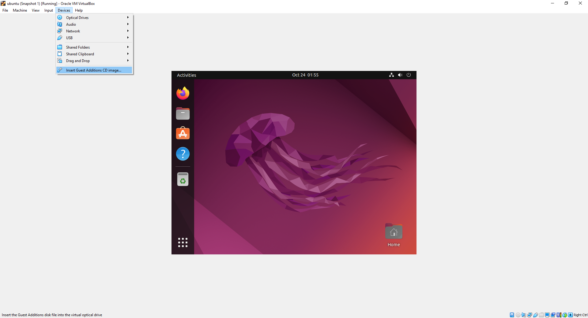
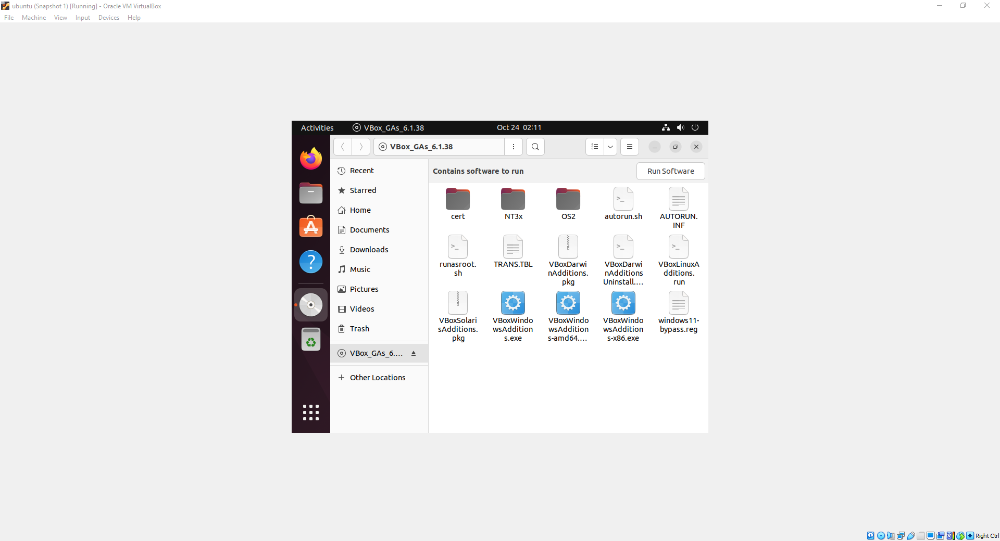

# Install VirtualBox Guest Additions on Ubuntu

```shell
sudo apt install -y build-essential dkms linux-headers-$(uname -r)
```

Insert the Guest Additions disk file into the virtual optical drive



Click the disk icon in the dock



Right click autorun.sh and Run as a Program


```shell
sudo reboot
```

```shell
sudo reboot
```
Right click the disk icon in the dock on click Eject


