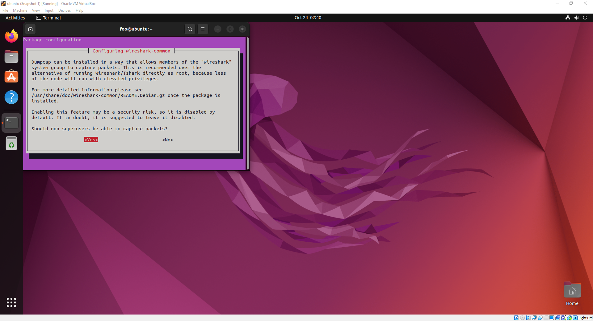

# Install Wireshark on Ubuntu

```shell
sudo apt install -y wireshark
```

Select Yes



> If not prompted to configure Wireshark in the previous step
> 
> ```shell
> sudo dpkg-reconfigure wireshark-common
> ```

``` shell
sudo adduser $USER wireshark
```

```shell
sudo reboot
```
